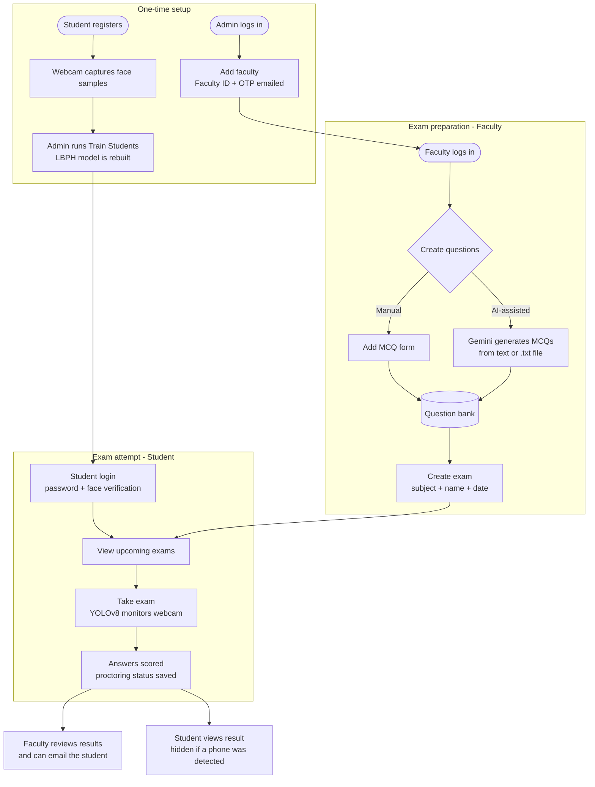
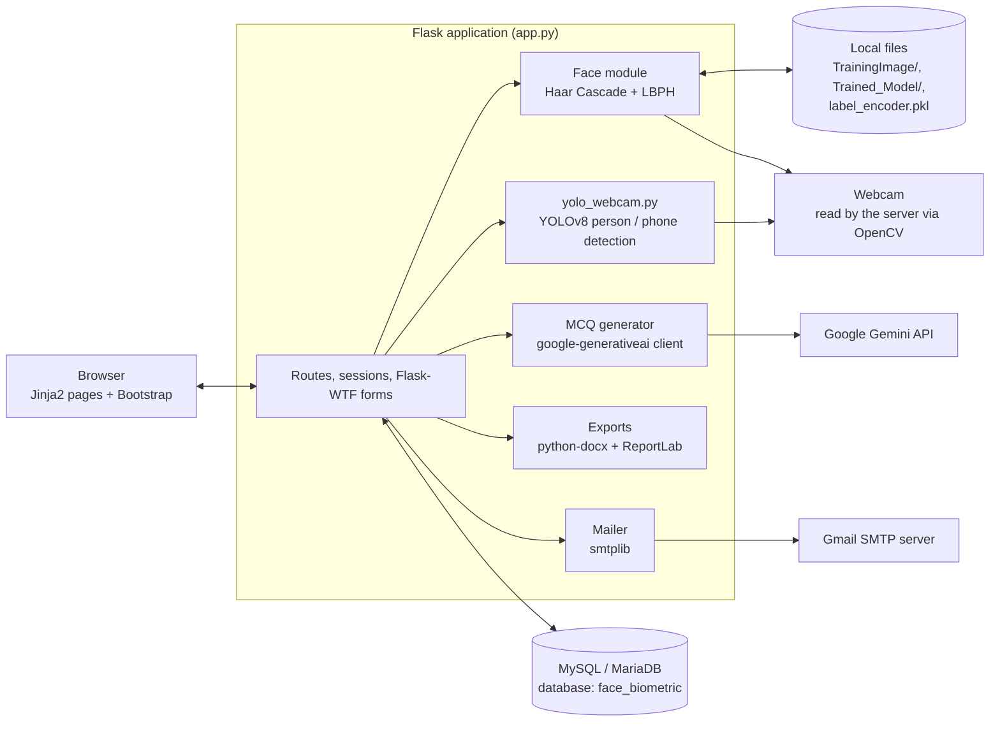
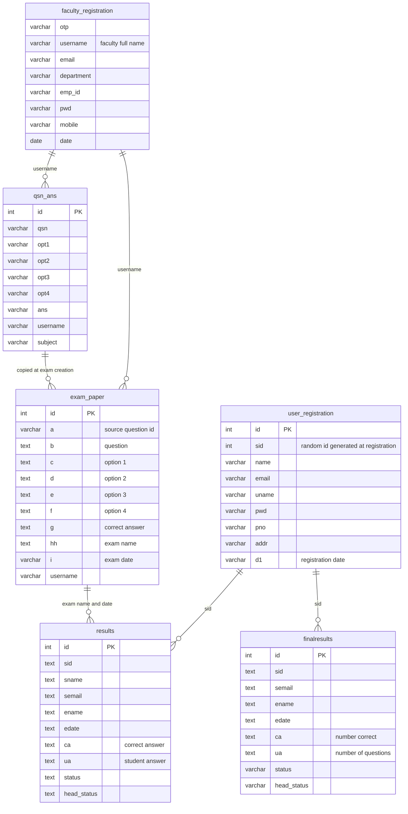
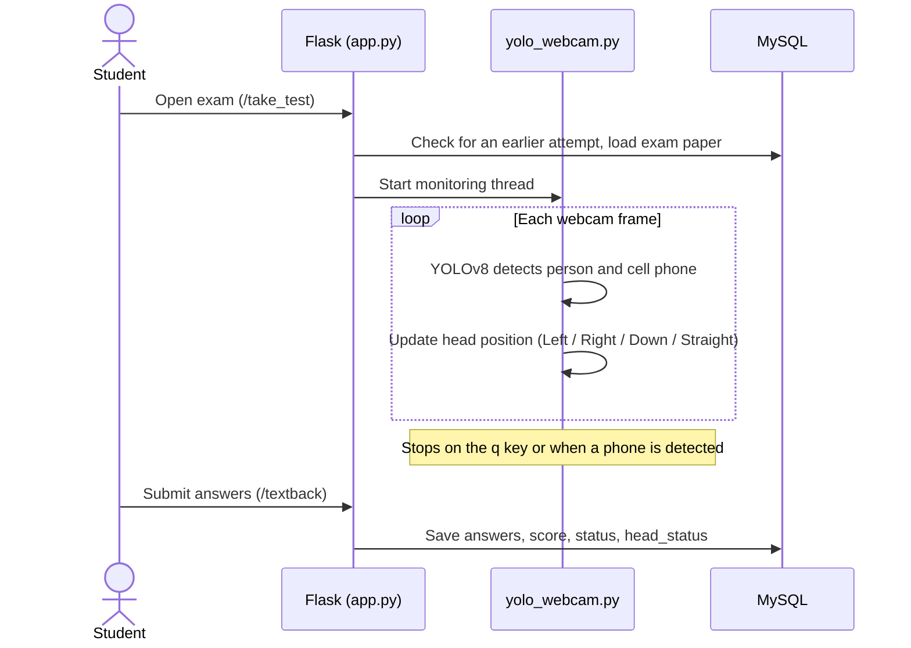

<div align="center">

<!-- Optional banner: create docs/banner.png (1600 x 400 px), then uncomment the next line. -->
<!--  -->

# ProctoGuard

**AI-Driven Smart Online Examination Authentication & Proctoring System**

Face-verified student login · YOLOv8 webcam monitoring · Gemini-assisted MCQ generation · Admin / Faculty / Student workflow

<br>

[](https://www.python.org/)
[](https://flask.palletsprojects.com/)
[](https://www.mysql.com/)
[](https://opencv.org/)
[](https://docs.ultralytics.com/)
[](https://ai.google.dev/)
[](https://getbootstrap.com/)

<br>

[Overview](#overview) · [Status](#implementation-status) · [Features](#key-features) · [Architecture](#system-architecture) · [Screenshots](#screenshots) · [Setup](#installation--setup) · [AI/ML](#aiml-implementation) · [Limitations](#limitations)

</div>

---

<details>
<summary><b>Table of contents</b></summary>

1. [Overview](#overview)
2. [Implementation Status](#implementation-status)
3. [Project Highlights](#project-highlights)
4. [Key Features](#key-features)
5. [System Workflow](#system-workflow)
6. [System Architecture](#system-architecture)
7. [User Roles](#user-roles)
8. [Technology Stack](#technology-stack)
9. [Project Structure](#project-structure)
10. [Screenshots](#screenshots)
11. [Installation & Setup](#installation--setup)
12. [Configuration](#configuration)
13. [Database](#database)
14. [Routes / Endpoints](#routes--endpoints)
15. [AI/ML Implementation](#aiml-implementation)
16. [Security](#security)
17. [Testing](#testing)
18. [Results / Output](#results--output)
19. [Roadmap](#roadmap)
20. [Limitations](#limitations)
21. [Project Team](#project-team)
22. [Academic Information](#academic-information)
23. [Contributing](#contributing)
24. [License](#license)
25. [Links & Contact](#links--contact)
26. [Acknowledgements](#acknowledgements)
27. [Summary](#summary)

</details>

---

## Overview

ProctoGuard is a web-based online examination platform built with **Flask**. It combines a role-based exam workflow (admin, faculty, student) with computer-vision checks:

- Students **enrol their face** during registration and are **face-verified at login**.
- During an exam, a **YOLOv8** model watches the webcam for a **cell phone** and tracks coarse head position.
- Faculty can write MCQs by hand or **generate them from text with the Google Gemini API**, schedule exams, and review each student's score together with the proctoring status.

**Problem it addresses.** As exams move online, impersonation and unauthorised help become hard to control. Many basic platforms offer question management and grading but little identity verification or automated monitoring. ProctoGuard explores how face recognition and object detection can be added to an exam platform to narrow that gap.

**Who it is for.** Instructors and institutions evaluating a remote-exam prototype, and students or developers studying how OpenCV, YOLO and an LLM API can be integrated into a Flask application.

> [!NOTE]
> ProctoGuard is an academic prototype. Webcam capture and monitoring run **on the machine hosting the Flask server** (via OpenCV), so it is designed for local, single-machine demonstration. See [Limitations](#limitations).

---

## Implementation Status

The project presentation and abstract describe the full vision of the system. This table separates what the **repository actually implements** from what is **proposed only**.

| Capability (from PPT / abstract) | Status | Notes |
|---|:---:|---|
| Separate Admin / Faculty / Student portals | ✅ | Access is separated by login page (see [Security](#security)) |
| Admin adds faculty | ✅ | Email contains Faculty ID and a 4-digit OTP; the OTP is not used in the login flow |
| Student registration with face capture | ✅ | Webcam capture using OpenCV Haar Cascade |
| Student login with face verification | ✅ | LBPH recognizer (see [Limitations](#limitations) for scope) |
| Manual MCQ creation | ✅ | |
| Automatic MCQ generation | ✅ | Google Gemini API (the PPT calls this a "transformer model") |
| Exam scheduling | ✅ | Exam name + date only (no time slot or duration) |
| Automatic scoring and result view | ✅ | |
| Cell-phone detection during an exam | ✅ | YOLOv8, COCO class `cell phone` |
| Head-direction tracking | ⚠️ | Bounding-box heuristic; only the last value is stored |
| Faculty review of proctoring status | ✅ | Status column + email action |
| Identity re-verification during the exam | ❌ | Face is verified at login only |
| Lip-movement detection | ❌ | Mentioned in objective/scope; not in the code |
| Multiple-person ("unauthorised individual") flag | ❌ | Persons are boxed but not counted or flagged |
| Real-time / customizable alerts to faculty | ❌ | Faculty emails the student manually after the exam |
| Activity tracking / audit log | ❌ | One status and one head value are saved per attempt |
| Admin: view faculty / view students | ❌ | `/view_registrations` exists but its template is missing |
| Profile view / edit | ⚠️ | Faculty profile page exists (not linked in navigation); no editing; no student profile |
| Analytics for faculty | ❌ | Results table only |
| Scalability for large exams | ❌ | Not demonstrated; monitoring is local to the server machine |

✅ implemented · ⚠️ partial · ❌ proposed in project documents, not in the repository

---

## Project Highlights

- **Three role-based portals** for admin, faculty and students
- **Face enrolment and login check** using OpenCV (Haar Cascade + LBPH)
- **Exam-time monitoring** with YOLOv8 (person and cell-phone detection, head-position heuristic)
- **AI-assisted question authoring**: Gemini generates MCQs; export to PDF, Word and answer key
- **End-to-end exam cycle**: question bank → exam → attempt → automatic score → faculty review
- **Email notifications** through SMTP (faculty registration, post-exam notice)
- **MySQL / MariaDB** persistence with a 6-table schema

---

## Key Features

### Admin
- Log in to a dedicated dashboard
- **Add Faculty**: name, email, department, employee ID, password, mobile (10-digit and letters-only checks, duplicate-email check); a confirmation email with Faculty ID and OTP is sent
- **Train Students**: rebuilds the face-recognition model from the captured images
- **View Question Papers**: read-only table of the questions in the bank (question, options, answer)

### Faculty
- Log in with the username (full name) and password set by the admin
- **Generate MCQs** with Gemini from pasted text or a `.txt` file: choose subject, number of questions and tone (formal / informal / neutral); download as **PDF**, **Word** or an **answer key**
- **Add MCQs manually**: subject, question, four options, correct answer
- **Create Exam**: pick one of your subjects, set the exam name and date; the subject's questions are copied into the exam paper in random order
- **View Papers** and **Exam Results**: per-exam table with each student's score and proctoring status; send the student a warning or an authentication email

### Student
- **Register** with personal details and a webcam face capture
- **Log in** with username and password, followed by a face check
- **View upcoming exams** and **take the exam** on a page with a live webcam feed
- **View results** (attempts where a cell phone was detected are not shown to the student)
- One attempt per exam per student

### Proctoring and AI
- Haar Cascade face detection and LBPH face recognition
- YOLOv8 detection of `person` and `cell phone`; head position labelled Left / Right / Down / Straight
- Gemini-based MCQ generation with retry on server errors

Details are in [AI/ML Implementation](#aiml-implementation).

---

## System Workflow



**In short:** the admin creates faculty accounts → students register and the admin trains the face model → faculty build a question bank (manually or with Gemini) and create an exam → the student logs in with password + face, takes the monitored exam → the score and proctoring status are stored → faculty review results and notify the student.

---

## System Architecture



The application is a **server-rendered monolith**: one Flask file (`app.py`) serves HTML templates, talks to MySQL, and calls the detection code in `yolo_webcam.py`. There is no separate frontend build and no REST/JSON API.

---

## User Roles

| Role | Entry point | Can do | Authentication |
|---|---|---|---|
| **Admin** | `/adminlogin` | Add faculty, train the face model, view all questions | Fixed demo credentials defined in `adminlogin()` in `app.py` |
| **Faculty** | `/faculty_login` | Generate / add MCQs, create exams, view papers, review results, send emails | Username (full name) + password stored in `faculty_registration` |
| **Student** | `/studentlogin` | Register, take exams, view results | Self-registration; username + password, then face check |

---

## Technology Stack

| Layer | Technologies |
|---|---|
| **Frontend** | HTML5, CSS3, JavaScript, Bootstrap, jQuery, Font Awesome, Jinja2 templates (TemplateMo "Scholar" theme) |
| **Backend** | Python, Flask 3.1, Flask-WTF / WTForms, Werkzeug, `smtplib` |
| **Database** | MySQL / MariaDB via `mysql-connector-python`; queries read into Pandas DataFrames |
| **Computer vision / ML** | OpenCV 4.10 (`opencv-contrib-python`), scikit-learn (`LabelEncoder`), Ultralytics YOLOv8 on PyTorch 2.5 |
| **Generative AI** | Google Gemini API through `google-generativeai` |
| **Document export** | `python-docx`, ReportLab |
| **Tools** | VS Code, XAMPP (as listed in the project PPT), Git / GitHub |

Exact pinned versions are in [`requirements.txt`](requirements.txt).

---

## Project Structure

```text
PROCTOGUARD-AI_DRIVEN_SMART_ONLINE_EXAMINATION_AUTHENTICATION_AND_PROCTORING_SYSTEM/
├── app.py                     # Flask app: routes, auth, face enrolment/login, exam flow, Gemini MCQs, exports, email
├── yolo_webcam.py             # YOLOv8 live detection (person, cell phone) + head-position heuristic
├── yolov8_saved_model.pt      # YOLOv8 checkpoint used for detection
├── Haarcascade/
│   └── haarcascade_frontalface_default.xml   # OpenCV Haar Cascade for face detection
├── db.sql                     # MySQL/MariaDB schema (database: face_biometric)
├── requirements.txt           # Pinned Python dependencies
├── test.py                    # Gemini API connectivity script (not an automated test suite)
├── templates/                 # 21 Jinja2 pages
│   ├── index.html
│   ├── admin_login.html · adminhome.html · add_faculty.html · viewqsn.html
│   ├── faculty_login.html · faculty_home.html · faculty_profile.html
│   ├── add_question.html · add_question2.html · create_exam.html
│   ├── viewqsn_faculty.html · view_papers.html · exam_results.html · exam_results1.html
│   └── studentlogin.html · add_student.html · studenthome.html
│       view_exam.html · take_test.html · view_result.html
├── static/
│   ├── assets/                # css, js, images, webfonts
│   └── vendor/                # bootstrap, jquery
├── person_details/person_details.csv       # header-only CSV (not used by the code)
├── personal_details/faculty_details.csv    # header-only CSV (not used by the code)
├── mcqs.pdf · mcqs.docx · answer_key.docx  # sample files produced by the MCQ export feature
├── docs/
│   └── screenshots/           # README images
└── .gitignore
```

Created at runtime (git-ignored): `TrainingImage/`, `Trained_Model/Trainner.yml`, `label_encoder.pkl`.

---

## Screenshots

<table>
  <tr>
    <td width="50%" align="center"><br><sub><b>Landing page</b> · entry points for Faculty, Students and Admin</sub></td>
    <td width="50%" align="center"><br><sub><b>Admin dashboard</b> · add faculty, train students, view questions</sub></td>
  </tr>
  <tr>
    <td width="50%" align="center"><br><sub><b>Faculty registration</b> · validated form, credentials emailed</sub></td>
    <td width="50%" align="center"><br><sub><b>Faculty dashboard</b> · generate, add, create, view, results</sub></td>
  </tr>
  <tr>
    <td width="50%" align="center"><br><sub><b>AI MCQ generator</b> · subject, text or file, count, tone</sub></td>
    <td width="50%" align="center"><br><sub><b>Create exam</b> · subject, exam name, date</sub></td>
  </tr>
  <tr>
    <td width="50%" align="center"><br><sub><b>Question bank</b> · generated questions with options and answers</sub></td>
    <td width="50%" align="center"><br><sub><b>Student dashboard</b> · view exams, view results</sub></td>
  </tr>
</table>

<!--
PROCTORING SCREENS - capture these, save them in docs/screenshots/, then uncomment this block.

<h3>Proctoring in action</h3>
<table>
  <tr>
    <td width="50%" align="center"><br><sub><b>Face enrolment</b> · webcam capture at registration</sub></td>
    <td width="50%" align="center"><br><sub><b>Face verification</b> · password + face check at login</sub></td>
  </tr>
  <tr>
    <td width="50%" align="center"><br><sub><b>Exam page</b> · MCQs with live webcam feed</sub></td>
    <td width="50%" align="center"><br><sub><b>Monitoring window</b> · person (green) and cell phone (red) boxes</sub></td>
  </tr>
  <tr>
    <td colspan="2" align="center"><br><sub><b>Faculty results</b> · scores with proctoring status and email action</sub></td>
  </tr>
</table>
-->

---

## Installation & Setup

> [!IMPORTANT]
> The project targets **Windows** (as listed in the project documentation). Several paths in the code use Windows-style separators (for example `Trained_Model\Trainner.yml`), so Linux / macOS need small path fixes.

### Prerequisites

| Requirement | Notes |
|---|---|
| **Python 3.10 – 3.12** | 3.10+ is required by the pinned NumPy / Matplotlib. Use the python.org installer so **Tkinter** is included (`app.py` imports it). |
| **MySQL or MariaDB** | XAMPP works. `app.py` connects as `root` with an empty password by default. |
| **Webcam** | Needed for registration, login verification and exams. |
| **Google Gemini API key** | Needed for AI MCQ generation only. |
| **Gmail account with an App Password** | Used by the email features (faculty registration, result notices). |
| **Git** | To clone the repository. |

### 1. Clone the repository

```bash
git clone https://github.com/sreyeshmandly/PROCTOGUARD-AI_DRIVEN_SMART_ONLINE_EXAMINATION_AUTHENTICATION_AND_PROCTORING_SYSTEM.git proctoguard
cd proctoguard
```

### 2. Create a virtual environment and install dependencies

```bat
python -m venv venv
venv\Scripts\activate
python -m pip install --upgrade pip
pip install -r requirements.txt
```

The install is large because it includes PyTorch and Ultralytics.

### 3. Create the database

Start MySQL / MariaDB, then import the schema (it creates the `face_biometric` database and six empty tables).

**Command Prompt:**

```bat
mysql -u root -p < db.sql
```

**PowerShell:**

```powershell
Get-Content db.sql | mysql -u root -p
```

**XAMPP alternative:** open phpMyAdmin → *Import* → choose `db.sql`.

Verify:

```bat
mysql -u root -p -e "USE face_biometric; SHOW TABLES;"
```

### 4. Configure secrets

The current code reads only **one** value from the environment. Set it in the same terminal before starting the app (`app.py` does not load a `.env` file):

```bat
:: Command Prompt
set GOOGLE_API_KEY=your-gemini-api-key
```

```powershell
# PowerShell
$env:GOOGLE_API_KEY = "your-gemini-api-key"
```

Then open `app.py` and replace `sender_address` and `sender_pass` with **your own** Gmail address and Gmail *App Password*. Adding a faculty member sends an email, so the request will fail after saving the record if SMTP is not configured. See [Configuration](#configuration) for every setting.

### 5. Run the application

```bat
python app.py
```

Open **http://127.0.0.1:5000**. The app must be started from the repository root because it loads `yolov8_saved_model.pt` and the Haar Cascade by relative path. `TrainingImage/` and `Trained_Model/` are created automatically on start.

### 6. First-run walkthrough

| Step | Who | Action |
|---|---|---|
| 1 | Admin | Log in from the landing page (demo credentials are in `adminlogin()` in `app.py`) → **Add Faculty** |
| 2 | Student | Landing page → **Students** → **Register**; a webcam window opens and captures face samples (stops automatically, or press `q`) |
| 3 | Admin | **Train Students**; do this after new registrations, otherwise face login has no model to load |
| 4 | Faculty | Log in with the faculty **full name** and password → **Generate** or **Add Questions** → **Create Exam** (use today's or a future date) |
| 5 | Student | Log in (password, then keep your face in view until it is recognised) → **View Exams** → **Take exam** |
| 6 | Faculty | **Exam Results** → open the exam → review scores and status → optionally send the email |

> [!TIP]
> During an exam, the OpenCV monitoring window keeps running until you press **`q`** in that window or a phone is detected. Based on the code, press `q` to end monitoring before submitting so the attempt's proctoring status is available.

<details>
<summary><b>Troubleshooting</b></summary>

| Problem | Fix |
|---|---|
| `mysql.connector.errors.DatabaseError` on start | Make sure MySQL is running and `db.sql` was imported. The connection is opened when `app.py` is imported. |
| `AttributeError: module 'cv2' has no attribute 'face'` | `pip uninstall -y opencv-python opencv-contrib-python` then `pip install opencv-contrib-python==4.10.0.84` |
| Error on student login after correct password | The face model does not exist yet. Register at least one student and run **Admin → Train Students**. |
| Camera does not open | Close other apps using the webcam; the code uses camera index `0`. |
| MCQ generation fails | Check that `GOOGLE_API_KEY` is set in the same terminal that runs `app.py`. |
| Face or model files not found on Linux / macOS | Fix the Windows-style paths in `app.py` (`\` separators, `Haarcascade` casing). |

</details>

---

## Configuration

| Setting | Where it lives | Current behaviour |
|---|---|---|
| `GOOGLE_API_KEY` | Environment variable read by `app.py` | Required for AI MCQ generation |
| Database connection | `mysql.connector.connect(...)` in `app.py` | `localhost:3306`, user `root`, empty password, database `face_biometric` |
| SMTP sender and app password | `sender_address`, `sender_pass` in `app.py` | Hard-coded; replace with your own values |
| Flask `SECRET_KEY` | `app.config` in `app.py` | Hard-coded; replace before any real use |
| Admin credentials | `adminlogin()` in `app.py` | Hard-coded demo credentials |
| Face match threshold | `conf > 38` in `studentlogin()` | Lower LBPH confidence = better match |
| Face samples at registration | `sampleNum > 350` in `Add_student()` | Capture stops after about 350 samples |
| Head-movement thresholds | `yolo_webcam.py` | 20 px horizontal shift, 15 px height drop |

`.env` is listed in `.gitignore`, but `app.py` does not call `load_dotenv()`, so environment variables must be set in the shell. Moving the remaining settings to environment variables is on the [Roadmap](#roadmap). **Never commit real keys, passwords or app passwords.**

---

## Database

**Engine:** MySQL / MariaDB · **Database:** `face_biometric` · **Schema file:** [`db.sql`](db.sql) (structure only, no seed data)

| Table | Purpose |
|---|---|
| `user_registration` | Student accounts (`sid`, name, email, `uname`, `pwd`, phone, address, registration date) |
| `faculty_registration` | Faculty accounts (`username` = full name, email, department, `emp_id`, `pwd`, mobile, OTP) |
| `qsn_ans` | Question bank: question, options 1–4, answer, owning faculty `username`, `subject` |
| `exam_paper` | Exam questions copied from the bank at exam creation |
| `results` | One row per answered question (`ca` = correct answer, `ua` = student's answer) |
| `finalresults` | One summary row per attempt (`ca` = number correct, `ua` = number of questions, proctoring `status`, `head_status`) |



> Relationships above are **logical** (matched on `username`, `sid`, exam name and date). The schema defines no foreign-key constraints. In `exam_paper`, the exam name and date are stored in the columns `hh` and `i`; the columns `exam_name` and `exam_date` exist but are not used by the code.

---

## Routes / Endpoints

ProctoGuard is server-rendered. The routes below return **HTML pages** (one returns an MJPEG stream); there is no JSON REST API.

| Method | Route | Intended role | Purpose |
|---|---|---|---|
| GET | `/` | Public | Landing page |
| GET, POST | `/adminlogin` | Admin | Admin login (Flask-WTF form) |
| GET, POST | `/adminhome` | Admin | Admin dashboard |
| GET, POST | `/Add_faculty` | Admin | Register a faculty member; emails Faculty ID + OTP |
| GET, POST | `/training` | Admin | Train the LBPH model from `TrainingImage/`; writes `Trained_Model/Trainner.yml` and `label_encoder.pkl` |
| GET | `/view_questions` | Admin | View all questions in the bank |
| GET | `/adminlogout` | Admin | Flash message and redirect to admin login |
| GET, POST | `/faculty_login` | Faculty | Faculty login |
| GET, POST | `/faculty_home` | Faculty | Faculty dashboard |
| GET | `/faculty/profile/<emp_id>` | Faculty | Profile view (not linked in navigation) |
| GET, POST | `/prediction` | Faculty | Generate MCQs with Gemini and save them to the bank |
| GET | `/download/<format>` | Faculty | Export the last generated quiz: `pdf`, `word` or `answer_key` |
| GET, POST | `/add_question`, `/qsnback` | Faculty | Manual MCQ form and save |
| GET, POST | `/create_exam_back` | Faculty | Create an exam from the faculty's questions for a subject |
| GET | `/viewqsn_faculty` | Faculty | Most recently created exam |
| GET | `/view_papers/<exam>` | Faculty | Questions of an exam |
| GET | `/exam_results` | Faculty | List of exams |
| GET | `/exam_results_back?s1=<exam>&s2=<date>` | Faculty | Results for one exam |
| GET | `/reply_mail/<s>/<s1>/<s2>/<s3>/<s4>/` | Faculty | Email the student: warning if `s4 == "Cell Phone"`, otherwise an authentication notice |
| GET, POST | `/Add_student` | Student | Registration with webcam face capture |
| GET, POST | `/studentlogin` | Student | Password login followed by face verification |
| GET | `/studenthome` | Student | Student dashboard |
| GET | `/view_exam` | Student | Upcoming exams (date ≥ today) |
| GET | `/take_test/<s>/<s1>/<s2>` | Student | Exam page; starts the monitoring thread (`s1` = exam name, `s2` = date) |
| GET | `/video_feed` | Student | Webcam MJPEG stream (`multipart/x-mixed-replace`) shown on the exam page |
| POST | `/textback` | Student | Submit answers; stores per-question rows and the attempt summary |
| GET | `/view_result` | Student | Own results (attempts with status `Cell Phone` are excluded) |

`/view_registrations` and `/portfolio_details` are defined in `app.py`, but their templates are not in the repository, so they are not usable yet.

<details>
<summary><b>Form fields for the main POST endpoints</b></summary>

| Endpoint | Fields |
|---|---|
| `/adminlogin`, `/faculty_login`, `/studentlogin` | `username`, `password`, `csrf_token` |
| `/Add_faculty` | `fullname`, `email`, `department`, `emp_id`, `pwd`, `cpwd`, `mobile` |
| `/Add_student` | `name`, `email`, `uname`, `pwd`, `cpwd`, `pno`, `addr` |
| `/qsnback` | `sub`, `qsn`, `opt1`–`opt4`, `ans` (`a`–`d`) |
| `/prediction` (multipart) | `sub`, `txt`, `file`, `number_of_questions`, `tone` (`formal` / `informal` / `neutral`) |
| `/create_exam_back` | `course_code` (subject), `exam_name`, `exam_date` |
| `/textback` | `dpr` (question count), `s1` (exam name), `s2` (date), `myans<i>`, `currans<i>` |

</details>

---

## AI/ML Implementation

### 1. Face enrolment and verification (OpenCV)

| Aspect | Details |
|---|---|
| **Purpose** | Check that the person logging in matches an enrolled student |
| **Detection** | Haar Cascade (`haarcascade_frontalface_default.xml`) with `detectMultiScale` |
| **Enrolment input** | Webcam frames → cropped grayscale face images saved to `TrainingImage/` (about 350 samples, or until `q`) |
| **Training** | *Admin → Train Students* loads the images, encodes the name labels with scikit-learn `LabelEncoder`, trains `cv2.face.LBPHFaceRecognizer`, and saves `Trained_Model/Trainner.yml` and `label_encoder.pkl` |
| **Inference** | After a correct password, each detected face goes to `recognizer.predict()`. Confidence ≤ 38 counts as a match (LBPH distance, lower is better). 10 matches → login proceeds. 20 low-confidence frames → "Unknown detection" |
| **Output** | A session for the credential-matched student, or a rejected login |

### 2. Exam monitoring (YOLOv8)

| Aspect | Details |
|---|---|
| **Model** | `yolov8_saved_model.pt`, a YOLOv8 checkpoint with the 80 COCO class names, loaded with Ultralytics. No custom training code or dataset is included |
| **Input** | RGB frames from `cv2.VideoCapture(0)` |
| **Classes used** | `person` (id 0) and `cell phone` (id 67); all other classes are ignored |
| **Head heuristic** | Uses the *person bounding box*: centre-x shift > 20 px → Left / Right; box-height drop > 15 px → Down; otherwise Straight |
| **Output** | Live OpenCV window (green box = person, red box = cell phone, `Head:` label). A phone detection ends monitoring with status `Cell Phone`. The final head value is returned |
| **Stored** | `status` and `head_status` in `results` and `finalresults` |



### 3. MCQ generation (Google Gemini)

| Aspect | Details |
|---|---|
| **Model / client** | `gemini-flash-latest` via `google-generativeai` |
| **Input** | Subject, pasted text or an uploaded `.txt` file, number of questions, tone |
| **Prompt** | An "expert MCQ maker" template that asks for a fixed format: question, options a–d, `Correct answer:` |
| **Post-processing** | The response is split on blank lines and parsed into question, options and answer, then saved to `qsn_ans`. Up to 3 attempts with exponential back-off on HTTP 500 errors |
| **Output** | Rendered quiz plus PDF (ReportLab), Word and answer-key (python-docx) downloads |

> [!NOTE]
> The upload field accepts `.txt`, `.pdf` and `.docx` in the browser, but the backend currently decodes the file as UTF-8 text, so use **plain-text files** (or paste the text). Review generated questions before creating an exam; the parser depends on the model following the requested format.

### What the AI does not do (yet)
- No identity re-check during the exam (face is verified at login only)
- No lip-movement, gaze, emotion or multiple-person analysis
- No accuracy or performance metrics are reported for any component

---

## Security

**Implemented**
- Separate login flows for admin, faculty and student
- Flask-WTF forms with **CSRF tokens** on the three login pages
- **Parameterised SQL** for logins, registrations and question inserts
- Server-side validation on faculty registration (10-digit mobile, letters-only name and department, duplicate email, password confirmation)
- **Face verification** as an additional step in student login
- Trained model, captured face images and `.env` are excluded by `.gitignore`

**Known gaps (planned hardening)**
- Passwords are stored and compared as **plain text** (`werkzeug.security` is imported but not used yet)
- SMTP credentials, Flask `SECRET_KEY` and admin credentials are hard-coded in `app.py`
- Routes are not protected by role-based decorators; logout does not clear the session
- Several queries (exam creation, exam paper, results) still build SQL by string concatenation
- The app runs with `debug=True` on `0.0.0.0`
- Face images are stored unencrypted on the server's disk

Do not deploy this project publicly until these items are addressed.

---

## Testing

There is **no automated test suite** in the repository, and no test coverage is claimed.

`test.py` is a small script that checks Gemini API connectivity. It uses the newer `google-genai` SDK, `python-dotenv` and a `GEMINI_API_KEY` variable, none of which are in `requirements.txt`, so install them first if you want to run it.

**Manual end-to-end checklist**

| # | Scenario | Expected result |
|---|---|---|
| 1 | Admin adds a faculty member | Record saved; email with Faculty ID and OTP sent |
| 2 | Student registers with the webcam | Row in `user_registration`; images in `TrainingImage/` |
| 3 | Admin runs **Train Students** | "Model Trained Successfully"; `Trained_Model/Trainner.yml` created |
| 4 | Student logs in with a wrong password | "Invalid Email / Password" |
| 5 | Student logs in with the correct password and own face | Redirect to the student dashboard |
| 6 | Faculty generates 5 MCQs from a text passage | Questions appear and are saved to the bank; PDF / Word / answer-key download |
| 7 | Faculty creates an exam for a future date | Exam appears under the student's *View Exams* |
| 8 | Student takes the exam and submits | Rows in `results` and `finalresults` |
| 9 | Student attempts the same exam again | "You have already attempted the exam" |
| 10 | Student shows a phone to the camera | Status `Cell Phone`; result hidden from the student; faculty can send a warning email |

**Suggested next step:** add `pytest` tests with the Flask test client, mocking OpenCV, YOLO and Gemini.

---

## Results / Output

The system produces:

- **Exam records**: per-attempt score (number correct out of total) plus proctoring `status` and `head_status`, visible to faculty per exam and to students on their results page
- **AI-generated question sets** exportable as PDF, Word and an answer key. Samples generated by the app are in the repository: [`mcqs.pdf`](mcqs.pdf), [`mcqs.docx`](mcqs.docx), [`answer_key.docx`](answer_key.docx)
- **Emails**: faculty registration details, and a post-exam warning or authentication notice

<details>
<summary><b>Sample generated question (from <code>mcqs.docx</code>)</b></summary>

```text
1: What's the main point of having a computer network anyway?
a) To make your computer run faster
b) To let devices like phones and servers swap data and share stuff
c) To ensure you never have to use a cable again
d) To turn your PC into a printer
Correct answer: b   (from answer_key.docx)
```

</details>

No quantitative accuracy or performance results are reported in the project documents or repository, so none are claimed here.

---

## Roadmap

**Proposed in the project documents (not implemented)**
- Emotion and behaviour analysis
- Multi-factor authentication and voice authentication
- Mobile app for students and faculty
- Analytics on exam performance and misconduct trends
- Better scalability and response time for large exams

**Engineering improvements (suggested)**
- Hash passwords and move all secrets to environment variables
- Enforce role-based access on every route and clear sessions on logout
- Compare the recognised face with the logged-in account and re-verify during the exam
- Capture the webcam in the browser (WebRTC) and run inference on the server, so remote students are supported
- Flag multiple persons, save evidence snapshots and keep a timeline of events
- Add exam duration, timer and auto-submit
- Add admin student / faculty management and profile editing
- Make file paths cross-platform; add automated tests and a Dockerfile

---

## Limitations

- **Local webcam architecture.** Capture and the monitoring window run on the machine that hosts Flask, so student and server must currently be the same machine.
- **Single-session design.** A module-level database connection and global monitoring variables mean it is intended for one exam session at a time.
- **Login face check scope.** The face check confirms the face matches *an enrolled student*; the recognised identity is not yet compared with the account that logged in.
- **Detection is basic.** YOLO uses a pretrained COCO checkpoint; head direction is a bounding-box heuristic, and only the final value is stored. No snapshots or event log are kept.
- **AI output needs review.** Generated MCQs depend on a format-sensitive parser; file upload supports `.txt` only.
- **Scheduling.** Exams have a date but no start time, duration or timer.
- **Platform.** Windows-oriented paths; not tested on Linux or macOS.
- **Security hardening pending** (see [Security](#security)).

---

## Project Team

| Name | Role | Links |
|---|---|---|
| _Add name_ | _Add role_ | _GitHub / LinkedIn_ |
| _Add name_ | _Add role_ | _GitHub / LinkedIn_ |

Repository owner: [@sreyeshmandly](https://github.com/sreyeshmandly)

---

## Academic Information

| | |
|---|---|
| **Project title** | ProctoGuard – Online Exam Conducting and Monitoring Platform |
| **Full name** | AI-Driven Smart Online Examination Authentication and Proctoring System |
| **Program** | B.Tech, Computer Science _(confirm)_ |
| **Institution** | _Add institution_ |
| **Academic year** | _Add year_ |
| **Guide / supervisor** | _Add name_ |

---

## Contributing

Suggestions and improvements are welcome.

1. Fork the repository and create a branch: `git checkout -b feature/your-change`
2. Make your changes and test them against the [manual checklist](#testing)
3. Commit with a clear message and open a pull request describing what changed and why

Please do **not** commit API keys, passwords, app passwords or real face images. `TrainingImage/`, `Trained_Model/` and `.env` are git-ignored for this reason.

---

## License

This repository does **not currently include a license file**. Until one is added, default copyright applies and reuse is not explicitly permitted. Third-party components keep their own licenses (see [Acknowledgements](#acknowledgements)).

---

## Links & Contact

| | |
|---|---|
| **Repository** | [github.com/sreyeshmandly/PROCTOGUARD-AI_DRIVEN_SMART_ONLINE_EXAMINATION_AUTHENTICATION_AND_PROCTORING_SYSTEM](https://github.com/sreyeshmandly/PROCTOGUARD-AI_DRIVEN_SMART_ONLINE_EXAMINATION_AUTHENTICATION_AND_PROCTORING_SYSTEM) |
| **Live demo** | Not available |
| **Developer** | [@sreyeshmandly](https://github.com/sreyeshmandly) |
| **LinkedIn / Email** | _Add link_ |

---

## Acknowledgements

| Component | Use | License / credit |
|---|---|---|
| [Ultralytics YOLOv8](https://docs.ultralytics.com/) | Object detection | AGPL-3.0 (commercial licence available) |
| [OpenCV](https://opencv.org/) | Face detection and recognition, camera capture | Haar Cascade file distributed with OpenCV |
| [Google Gemini API](https://ai.google.dev/) | MCQ generation | Google terms of service |
| TemplateMo "Scholar" theme (distributed via ThemeWagon) | Front-end design | Credit retained in the page footer |
| Bootstrap, jQuery, Font Awesome | UI libraries bundled under `static/` | Respective licenses |

---

## Summary

ProctoGuard is a Flask-based exam platform that ties a complete admin–faculty–student exam cycle to computer-vision checks: OpenCV face verification at login, YOLOv8 cell-phone and head-position monitoring during the exam, and Gemini-assisted question authoring. The core workflow is implemented end to end; several proposed proctoring features (lip movement, multi-person flags, in-exam identity re-checks, live alerts) and production-grade security remain future work, as documented above.

<div align="center">

<sub>If this project is useful for your learning, consider giving the repository a star.</sub>

</div>
